# Sprint 1 - Developing a DB and UI Prototype

## Sprint Goals

Develop a design for the database and a UI prototype that simulates the key functionality of the system. Test and refine the UI so that it can serve as the model for the next phase of development in Sprint 2.

### Specific Goals

- Design the database:
    - Tables
    - Fields / types
    - Primary keys
    - Default / nullable values
    - Relationships (foreign keys)

- Design the UI
    - Key pages
    - User interactions and 'flow'
    - Page layouts / features
    - Colour palette
    - Etc.

## Initial Database Design
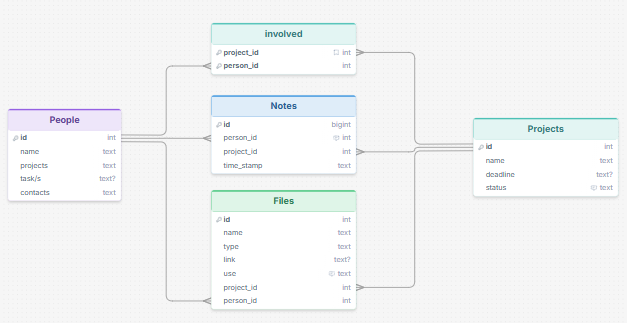

### Required Data Input

The system will get

- When people make an account, they are required to put a name and contact/s, this can be viewed on a profile page/drop-down.

- When people create a project they are required to enter who is apart of the project,
(they could add the person through the id that is automatically given to the user when they create an account, or they could look up their name), this can be viewed in a section about project details.

- When people create a project they are required to enter a name for it, and if it has a deadline, during the project they can change the status between unfinished and finished, this can be viewed on the projects page.

- When people add a file to a project they can give it a "use", they will be suggested to say "Working file" or "Resource" but can put anything they like, this should be viewable just under the file.

### Required Data Output

The system will display
- integers
- text
- text? (some text can be null, see design screenshot above)

### Required Data Processing

Replace this text with a description of how the data will be processed to achieve the desired output(s) - any processes / formulae?

## UI 'Flow'

The first stage of prototyping was to explore how the UI might 'flow' between states, based on the required functionality.

This Figma demo shows the initial design for the UI 'flow':
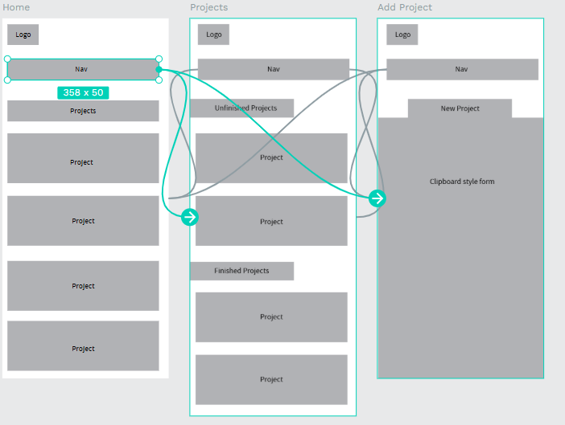

*https://design.penpot.app/#/view?file-id=81f57451-85cc-819d-8008-76dbd5996cf3&page-id=81f57451-85cc-819d-8008-76dbd5996cf4&section=interactions&index=0&share-id=3be9e5e1-190f-8090-8008-76dc16543f9c*

### Testing

I showed this UI flow template to my end-user, they didn't like how it opened right to the home screen, they asked if there could be some sort of loading screen/splash screen before hand.

### Changes / Improvements

I added a splash screen.
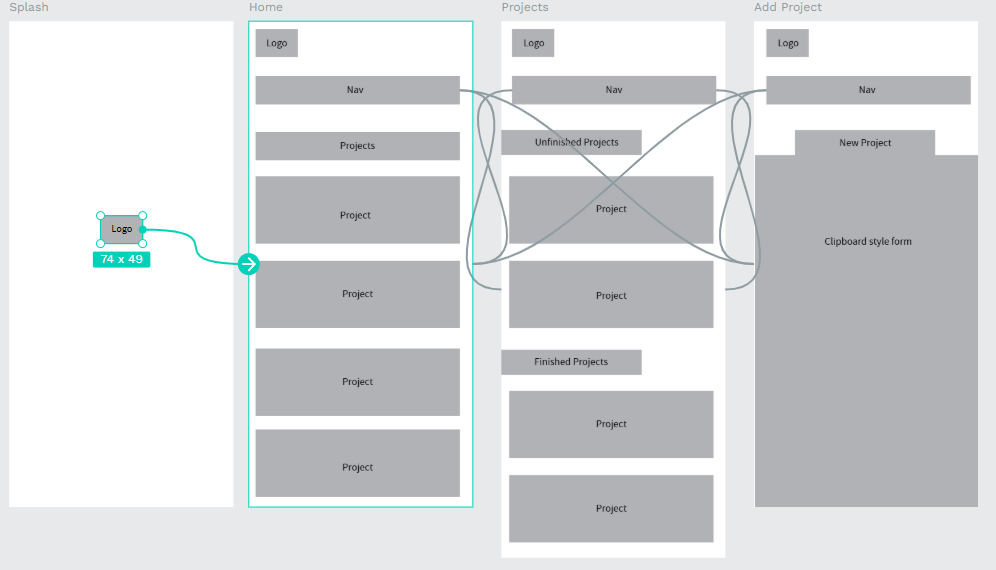

*https://design.penpot.app/#/view?file-id=81f57451-85cc-819d-8008-76dbd5996cf3&page-id=81f57451-85cc-819d-8008-76dbd5996cf4&section=interactions&index=0&share-id=3be9e5e1-190f-8090-8008-76ea4f9686b4*

## Initial UI Prototype

The next stage of prototyping was to develop the layout for each screen of the UI.

### Changes / Improvements

When I was making my layouts for each screen, I resized that having only one page for all finished and upcoming projects could make the user scroll a lot. So I separated them (see below).

I also decided that projects on the home page should separated into due and finished projects, so its easier for users to find things, and that due projects should be displayed in order of when its due.

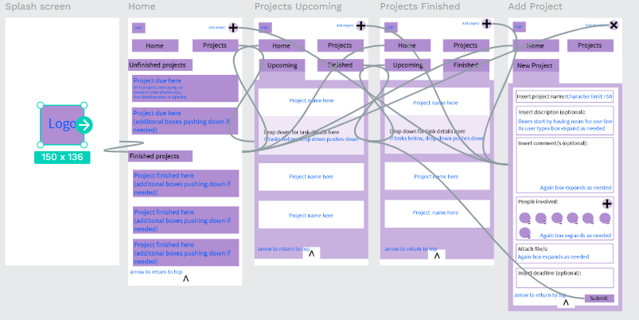

*https://design.penpot.app/#/view?file-id=3be9e5e1-190f-8090-8008-6de71b4fba1b&page-id=3be9e5e1-190f-8090-8008-6de71b4fba1c&section=interactions&index=0&share-id=81f57451-85cc-819d-8008-76ef30d55776*

### Testing

I realized that having the home page may be unessisary, and maybe the app should just immediately go to the upcoming projects. I asked my user what they thought of this.

I showed this updated UI template to my user.

### Changes / Improvements

We agreed that...
So I...
They liked that...

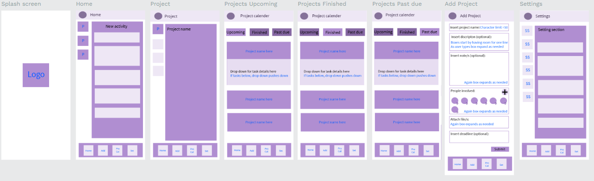

*https://design.penpot.app/#/view?file-id=81f57451-85cc-819d-8008-772f6aae5fb0&page-id=81f57451-85cc-819d-8008-772f6aae5fb1&section=interactions&index=0&share-id=3be9e5e1-190f-8090-8008-7962b28e1c45*

## Refined UI Prototype     

Having established the layout of the UI screens, the prototype was refined visually, in terms of colour, fonts, etc.

I has a conversation with my user before going into this, where asked specifically for a dull, "peaceful", purple, colour palette, that uses black and white for details.
So I came up with these colour palletes:
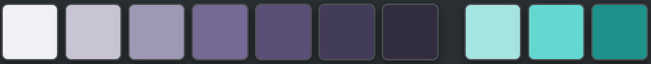
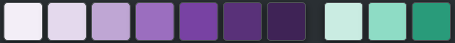
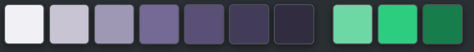

I showed these colour pallettes to my end-user, they asked for the colour palette to be monochromatic, and said they liked the more destaturated one.

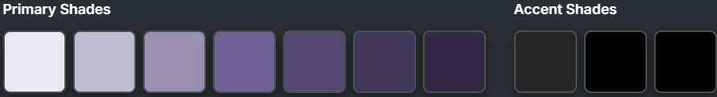
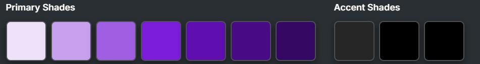
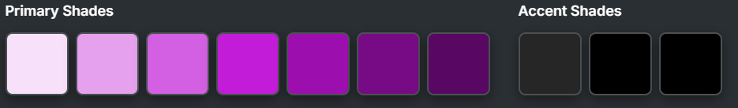
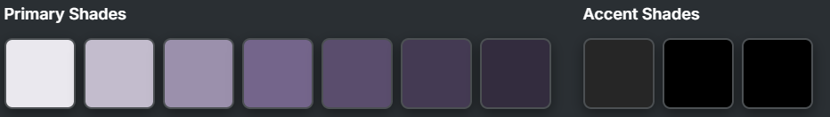
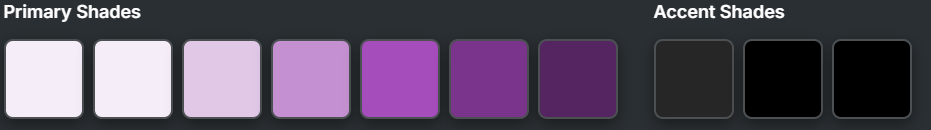

I showed these colour pallettes to my end-user, they said...

They quiet liked these colours but wanted to make minor changes, they sent back this color palette, 

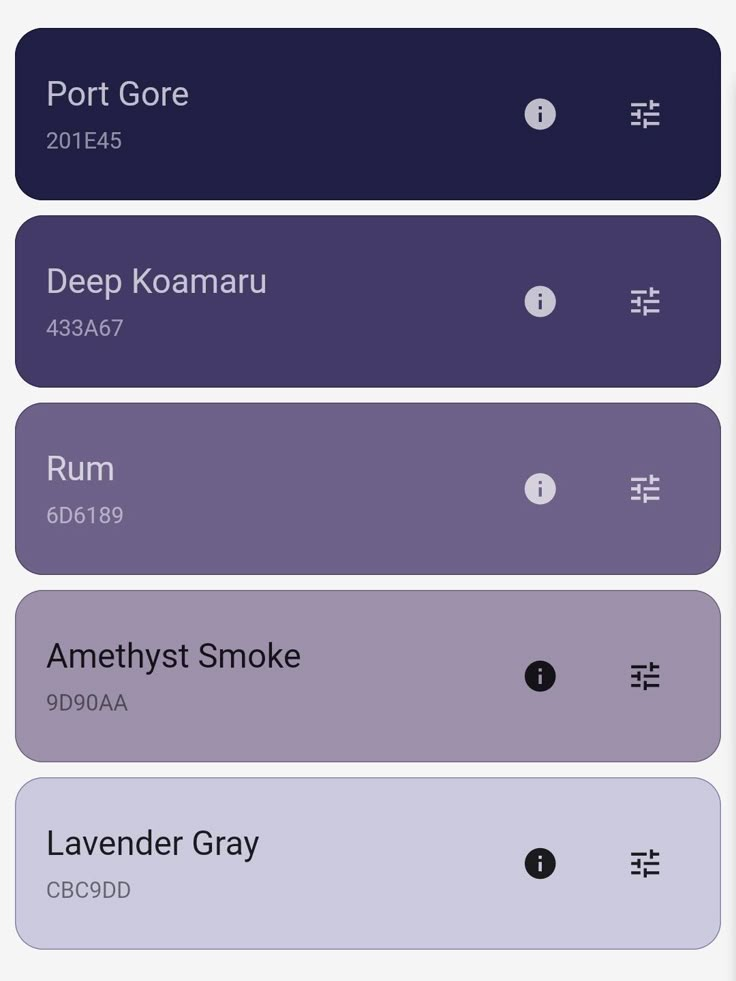

*FIGMA REFINED PROTOTYPE - PLACE THE FIGMA EMBED CODE HERE - MAKE SURE IT IS SET SO THAT EVERYONE CAN ACCESS IT*

### Testing

Replace this text with notes about what you did to test the UI flow and the outcome of the testing.

### Changes / Improvements

Replace this text with notes any improvements you made as a result of the testing.

*FIGMA IMPROVED REFINED PROTOTYPE - PLACE THE FIGMA EMBED CODE HERE - MAKE SURE IT IS SET SO THAT EVERYONE CAN ACCESS IT*

## Sprint Review

Replace this text with a statement about how the sprint has moved the project forward - key success point, any things that didn't go so well, etc.

