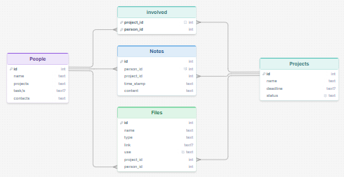
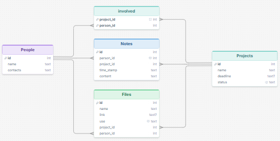
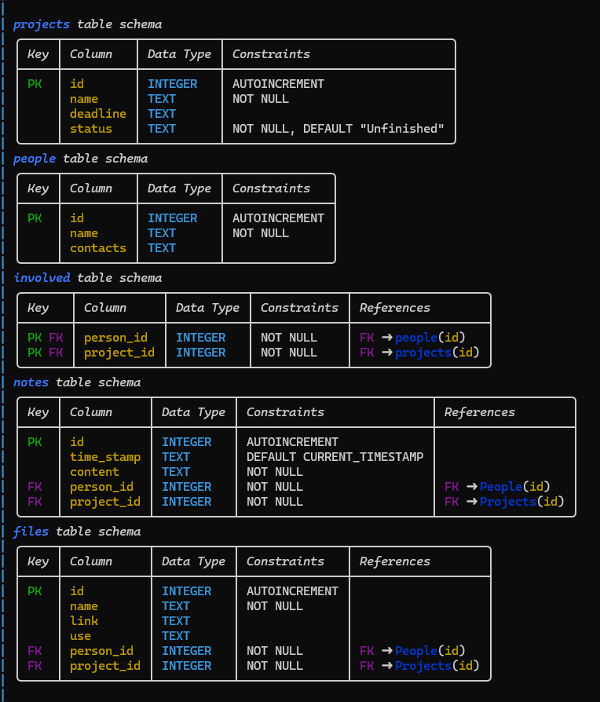

# Sprint 2 - Implement Database and Display of Test Data

## Sprint Goals

Implement the database, populated with test data. Create queries that retrieve test data, and display this on web pages as needed. Test and refine the queries and data display, so that it stands as the basis of the next sprint.

### Specific Goals

**Edit these goals as needed**

- Implement the database
- Add test data to the database
- Create the following web pages:
    - Home pages showing...
    - Details page for ...
    - Etc.
- Develop SQL database queries to:
    - Retrieve all ...
    - Retrieve specific ...
    - Etc.

## Small update

I realized while adding test data to the data base that I forgot to add a "content" felid in the table, so the note actually contains a note!

Updated table:

## Small update

I realized that having "tasks" table was unnecessary, as who is in charge of what can be conveyed through the projects "notes", my user agreed to this and I updated the tables accordingly.
I showed this to my end-user because I thought the felid "Type" was unessisary (this is something I implemented, not asked by the user) they agreed.

Updated table:

## Testing Database
### Changes / Improvements
Replace this text with notes about what you are testing, how you tested it, and the outcome of the testing

**PLACE SCREENSHOTS AND/OR ANIMATED GIFS OF THE TESTING HERE**

## Sprint Review

Replace this text with a statement about how the sprint has moved the project forward - key success point, any things that didn't go so well, etc.

